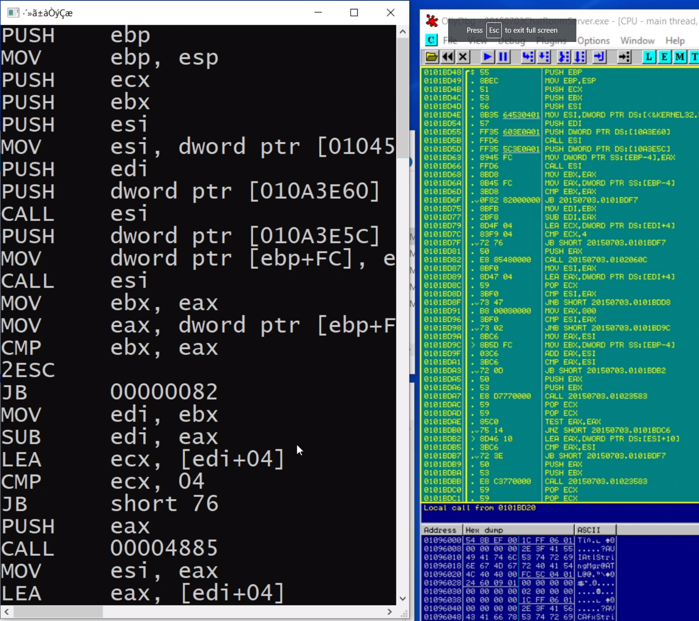

# x86-disassembler

Copy the opcode into the input.txt file, and the disassembler will output the result to the console and the output.txt file.

Reference: Appendix A OPCODE MAP in [Intel 64 and IA-32 Architectures Software Developer's Manual](https://www.intel.com/content/dam/www/public/us/en/documents/manuals/64-ia-32-architectures-software-developer-instruction-set-reference-manual-325383.pdf).

Video Demo: [Vimeo](https://vimeo.com/432441815)

Executable File Download: [Google Drive](https://drive.google.com/drive/folders/185WiQ4llzK_Ar2VrQnO8W0d6DcfrJLf3?usp=sharing)

Features:
- One-byte Opcode coverage: 100%
- Two-byte Opcode coverage: 90% (the popular ones) 0F00; 0F80-0F8F; 0F90-0F9F; 0FB6, 0FB7; 0FBE, 0FBF; 0FAF.
- Three-byte Opcode coverage: None 

# x86反汇编引擎

把操作码复制到input.txt文件，反汇编引擎会把结果输出到命令行窗口和output.txt文件。

参考资料： [Intel 64 and IA-32 Architectures Software Developer's Manual](https://www.intel.com/content/dam/www/public/us/en/documents/manuals/64-ia-32-architectures-software-developer-instruction-set-reference-manual-325383.pdf)的附录A OPCODE MAP。

演示视频：[BiliBili](https://www.bilibili.com/video/BV1MT4y1j7hX/)

可执行文件下载：[蓝奏云](https://wws.lanzous.com/i35rkevi6nc)

功能：
- 单字节操作码：100%覆盖。
- 双字节操作码：90%覆盖（最常见的那些） 0F00; 0F80-0F8F; 0F90-0F9F; 0FB6, 0FB7; 0FBE, 0FBF; 0FAF。
- 三字节操作码：没有写。
